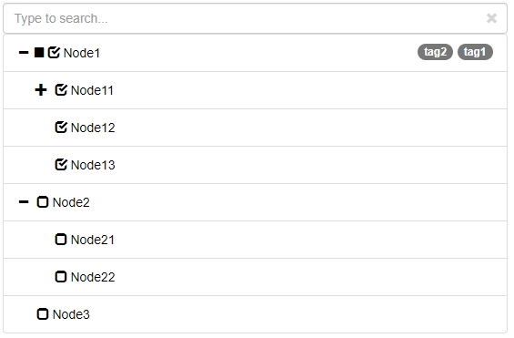
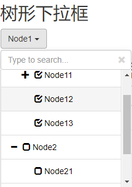
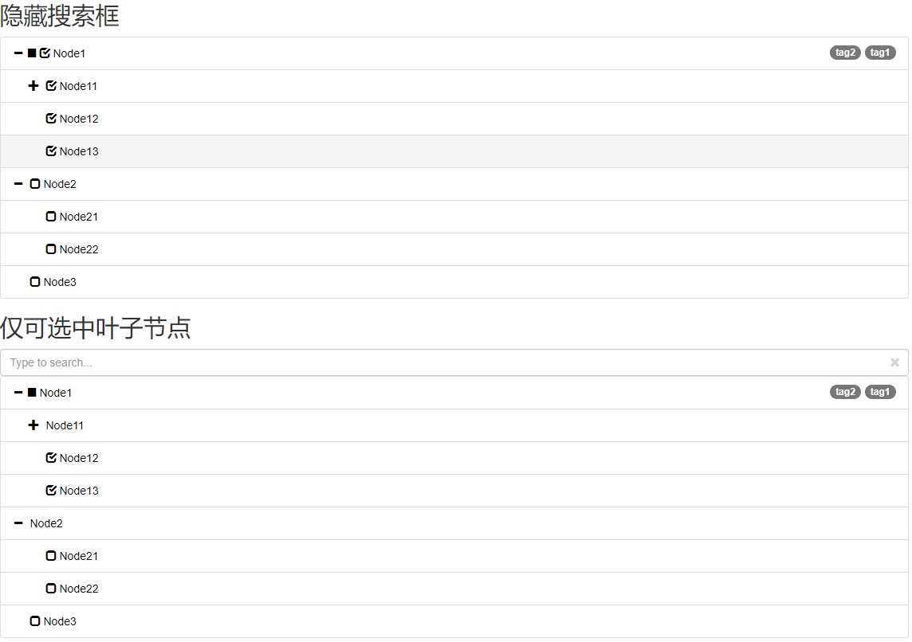

TreeSelect
==========

使用 [bootstrap-treeview](https://jonmiles.github.io/bootstrap-treeview/)
生成树形选择器

1. 支持扁平json数据结构，指定pid即可
2. 支持把Select转化成树，支持单选和多选，支持`data-`设置options
3. 选择节点时，可自动选中子节点
4. 所有兄弟节点选中时，可自动选中父节点
5. 支持使用`data-section`配置分级节点形式的数据，例如shiro的权限串
6. 支持树形下拉框
7. 支持搜索
8. 支持仅叶子节点可选
### Demo
For demo, See http://kangarooxin.github.io/treeSelect







### Useage:
#### Demo1: 使用扁平JSON数据
```html
<div id="selectTree"></div>
```
```javascript
var data = [
    { id: 1, text: 'Node1', pid: 0, checked: true, icon:"glyphicon glyphicon-stop", tags: ['tag1','tag2']},
    { id: 2, text: 'Node2', pid: 0 },
    { id: 3, text: 'Node3', pid: 0 },
    { id: 4, text: 'Node11', pid: 1, checked: true },
    { id: 5, text: 'Node12', pid: 1, checked: true },
    { id: 6, text: 'Node13', pid: 1, checked: true },
    { id: 7, text: 'Node21', pid: 2 },
    { id: 8, text: 'Node22', pid: 2 },
    { id: 9, text: 'Node111', pid: 4, checked: true },
    { id: 10, text: 'Node112', pid: 4, checked: true },
];
$('#selectTree').treeSelect({
    data: data,
    onCheckChange: function(nodes, $tree, $container) {
        
    }
});
```
#### Demo2: 把Select转化成树
```html
<select id="selectTree2" multiple="multiple" data-show-icon="true" data-levels="1">
    <option value="1" data-pid="0" selected="selected" data-icon="glyphicon glyphicon-stop" data-tags="tag1,tag2">Node1</option>
    <option value="2" data-pid="0">Node2</option>
    <option value="3" data-pid="0">Node3</option>
    <option value="4" data-pid="1" selected="selected">Node11</option>
    <option value="5" data-pid="1" selected="selected">Node12</option>
    <option value="6" data-pid="1" selected="selected">Node13</option>
    <option value="7" data-pid="2">Node21</option>
    <option value="8" data-pid="2">Node22</option>
    <option value="9" data-pid="4" selected="selected">Node111</option>
    <option value="10" data-pid="4" selected="selected">Node112</option>
</select>
```
```javascript
$('#selectTree2').treeSelect();
```
#### Demo3: 树形下拉框
```html
<select id="selectTree3" multiple="multiple" data-show-icon="true" data-levels="1" data-dropdown="true">
    <option value="1" data-pid="0" selected="selected" data-icon="glyphicon glyphicon-stop" data-tags="tag1,tag2">Node1</option>
    <option value="2" data-pid="0">Node2</option>
    <option value="3" data-pid="0">Node3</option>
    <option value="4" data-pid="1" selected="selected">Node11</option>
    <option value="5" data-pid="1" selected="selected">Node12</option>
    <option value="6" data-pid="1" selected="selected">Node13</option>
    <option value="7" data-pid="2">Node21</option>
    <option value="8" data-pid="2">Node22</option>
    <option value="9" data-pid="4" selected="selected">Node111</option>
    <option value="10" data-pid="4" selected="selected">Node112</option>
</select>
```
```javascript
$('#selectTree3').treeSelect();
```
#### Demo4: 使用分级节点数据
```html
<select id="selectTree4" multiple="multiple" data-show-icon="true" data-levels="1" data-section="true">
    <option value="1" data-section="Node1" selected="selected" data-icon="glyphicon glyphicon-stop" data-tags="tag1,tag2">Node1</option>
    <option value="2" data-section="Node2">Node2</option>
    <option value="3" data-section="Node3">Node3</option>
    <option value="4" data-section="Node1:Node11" selected="selected">Node11</option>
    <option value="5" data-section="Node1:Node12" selected="selected">Node12</option>
    <option value="6" data-section="Node1:Node13" selected="selected">Node13</option>
    <option value="7" data-section="Node2:Node21">Node21</option>
    <option value="8" data-section="Node2:Node22">Node22</option>
    <option value="9" data-section="Node1:Node11:Node111" selected="selected">Node111</option>
    <option value="10" data-section="Node1:Node11:Node111" selected="selected">Node112</option>
</select>
```
```javascript
$('#selectTree4').treeSelect();
```
### Options:
```javascript
 $.fn.treeSelect.defaults = {
    data: [],
    flatData: true,//扁平json数据，使用pid指定父节点
    dropdown: false,//下拉选择框
    dropdownEmptyText: '请选择...',//下拉选择框不选择时显示的内容
    section: false,//不使用pid，使用分级节点和分隔符构建父子节点
    sectionName: 'section', //分级节点名称
    sectionDelimiter: ':',  //分级节点分隔符
    searchable: true, //可以搜索
    searchIgnoreCase: true, //搜索忽略大小写
    searchExactMatch: false, //搜索全匹配
    idName: 'id',
    pidName: 'pid',
    textName: 'text',
    iconName: 'icon',
    tagsName: 'tags',
    checkedName: 'checked',
    multiple: true, //多选
    onlyLeafSelectable: false, //仅可选中叶子节点
    autoCheckChildNode: true,//选中节点时自动选中所有子节点
    autoCheckParentNode: true, //兄弟节点都被选中时，自动选中父节点
    ignoreChildNode: true,//选中父节点时上报事件中忽略子节点
    showIcon: true,//显示图标
    showTags: true,//显示标签
    levels: 2,//默认展开2层
    color: "#000", //文字颜色
    maxHeight: 0,  //框体最大高度，0不限制
    div: '<div class="tree-select">' +
        '   <div class="tree-select-search">' +
        '       <input type="text" class="form-control" placeholder="Type to search...">' +
        '       <span class="glyphicon glyphicon-remove tree-select-search-clear"></span>' +
        '   </div>' +
        '   <div class="tree-select-view"></div>' +
        '</div>',
    getDropdownText: function (checkedDatas) {//下拉选择框选中后展示内容
        var checkedTexts = checkedDatas.map(function (value) {
            return value.text;
        });
        return checkedTexts.join(',');
    },
    onCheckChange: function (checkedDatas, $treeSelect, $container) {
    },
    onSearchResult: function(searchResultDatas, $treeSelect, $container) {
    }
};
```
